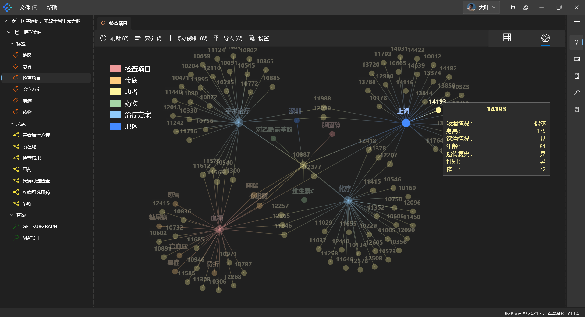
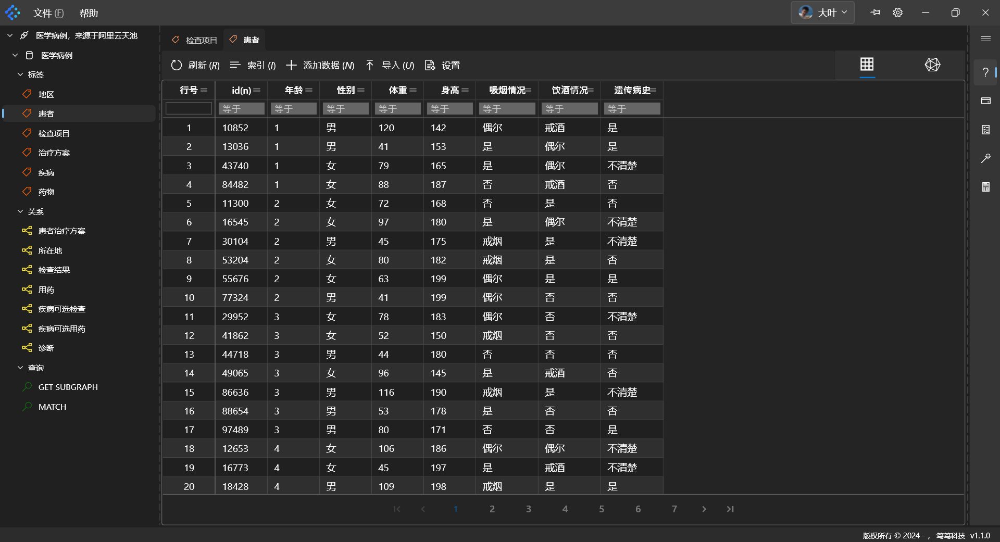

# Star Shadow · Graph Database Client

> **Star Shadow** is not an open source project. The current repository is only used to release the installation package of Star Shadow, manage requirements, user feedback, etc.

<p align="center">
    </img>
</p>

<p align="center">Bring people closer to knowledge graphs</p>

**Star Shadow** is a graph database client that provides a visual operation interface for graph databases, allowing users to operate graph databases in a graphical way.
**Star Shadow** adopts a new technical architecture ([Flutter](https://github.com/flutter/flutter)), and currently supports the following operating systems: Windows, macOS, Ubuntu | Kylin three major common operating systems.
At the graph database level, it currently supports: [Nebula Graph](http://nebula-graph.com.cn/).




- Official website: [https://dudu.ltd](https://dudu.ltd)
- Documentation: [https://dudu.ltd/docs/en/StarShadow/new-player.html](https://dudu.ltd/docs/en/StarShadow/new-player.html)

## What is Star Shadow?
- In the graph database ecosystem, it is striving to follow the example of `Navicat` in the relational database ecosystem.
- It is an explorer in the direction of desktop applications in the graph database ecosystem.

## Download and Install

### Download ZIP

- Windows: [StarShadow-win-v1.1.0.zip](https://github.com/dudu-ltd/star-shadow-package/releases/download/v1.1.0/StarShadow-win-v1.1.0.zip)
- macOS: [StarShadow-macos-v1.1.0.dmg](https://github.com/dudu-ltd/star-shadow-package/releases/download/v1.1.0/StarShadow-macos-v1.1.0.dmg)
- linux: [StarShadow_1.1.0-amd64.deb](https://github.com/dudu-ltd/star-shadow-package/releases/download/v1.1.0/StarShadow_1.1.0_amd64.deb)

#### Installation

- Windows

    The current version uses the green version, which can be directly unzipped to the directory you want to install. Enter the folder, then find the 【Unique Icon.exe】 and double-click to open it.

- macOS
    
        Double-click the downloaded `StarShadow-macos-v1.1.0.dmg` to install.

- Ubuntu 24.04

    ```shell
    sudo dpkg -i StarShadow_1.1.0_amd64.deb
    sudo apt-get install libkeybinder-3.0
    sudo apt-get install libmpv2
    # /usr/local/lib/StarShadow 
    ```

- Kylin 24.04

    ```shell
    sudo dpkg -i StarShadow_1.1.0_amd64.deb
    sudo apt-get install libkeybinder-3.0
    # /usr/local/lib/StarShadow
    ```

Use WeChat to complete registration and login, or choose 【Try】 to use it without logging in.

## Quick Start Steps

If you don't have your own graph database yet, or want to know our recommended usage, you can get started with StarShadow through the following steps.

### Using the Sample Project

1. Click the link to the [sample project](https://github.com/dudu-ltd/star-shadow-sample)
2. Find 【Code】 and click
3. In the pop-up window, find 【Download ZIP】 and click
4. Place the downloaded zip file in the folder where you want to place the StarShadow data
5. Unzip the zip file to the 【current folder】
6. Return to the opened StarShadow graph database client
    1. Find 【File】 in the upper left corner
    2. Click 【Open Folder】
    3. Select the 【star-shadow-sample-main】 folder that was unzipped in step 5
    4. Click 【Select Folder】 in the lower right corner of the pop-up window
7. At this point, you can experience StarShadow through the sample project

> In step 3 above, you can also use git clone, but to avoid you in the subsequent use process, mistakenly submit the connection parameters of the private database, please try to use the download ZIP method.
If you use git to manage the StarShadow workspace in future projects, please be careful when submitting to the open source repository. Because it contains the connection information of the database.


#### Using the Sample Project

1. In the opened left navigation tree, right-click to manage the corresponding schema;
2. In the specific data table (tag, edge), the serial number column supports right-click to pop up the interface to complete the operation on the data;
3. Under the 【Query】 tree node, you can select 【MATCH】 to experience the script we prepared for you this time, which includes the following functions:
    1. Based on nGQL, we have extended the parameter template. You can switch between multiple sets of parameters by clicking on the serial number 1, 2, 3... on the right side of the parameter panel in the code editing area. Select which set of parameters, click 【Run】, and the query script will use which set of parameters to complete the data query:
    2. In the example usage of 【MATCH】, you can experience the merged table header, the visualization of the node relationship diagram, and the visualization of the path data
    3. In the example usage of 【GET SUBGRAPH】, you can experience that each column in the result is composed of tables, and you can open a pop-up composed of tables by clicking on a cell, thereby realizing the reading of table data.

### When adding a data source, use the sample data source we provide

1. Find 【File】->【Add Connection】 in the software
2. Fill in the following information:
    - Name: Medical case, from Alibaba Cloud Tianchi
    - Type: NebulaGraph
    - Host: gdbc.nebula://139.9.187.207:9669
    - User: LetUs
    - Password: WalkTogether
3. Click 【Check】 to confirm the availability of the sample data source
4. Click 【Save】 to complete the addition of the data source

> To provide users with a more complete experience, we have granted DBA permissions to the test account. Please try to maintain the relative integrity of the data we provide during use so that other users can experience more functions.
In addition, the data is shared among users, so please be careful when uploading private data.

## Finally
We will continue to supplement the common scripts of the graph database through the sample project in the future. If you have formed a useful template in the subsequent process and want to share it with others, please contact us.

So far, we have introduced some basic usage here. If you want to know how the graphical interface operation works, please go to the next stop: [Guide](./help.html)

We hope that our work can help you remove some obstacles in the process of exploring the graph, and we hope that we can always accompany you.
