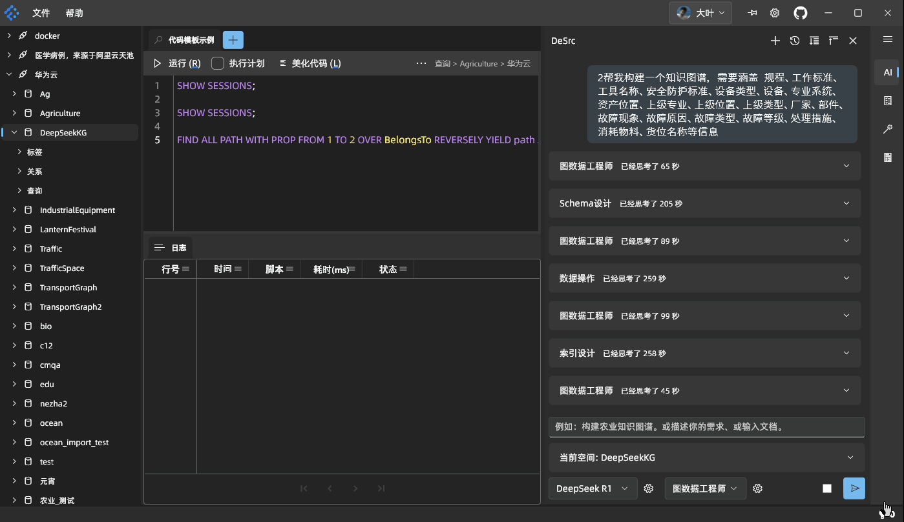
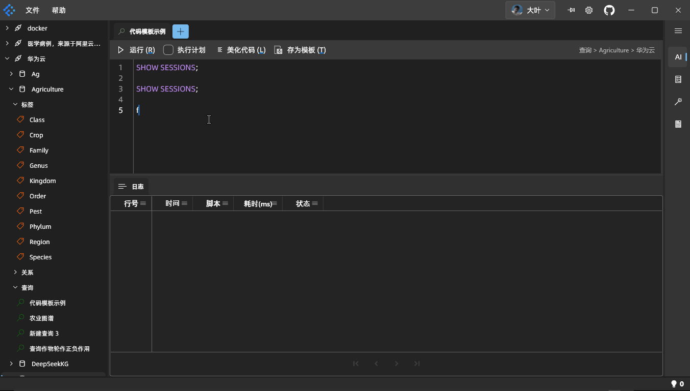
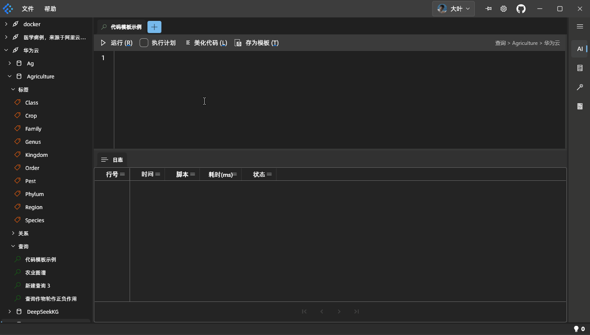
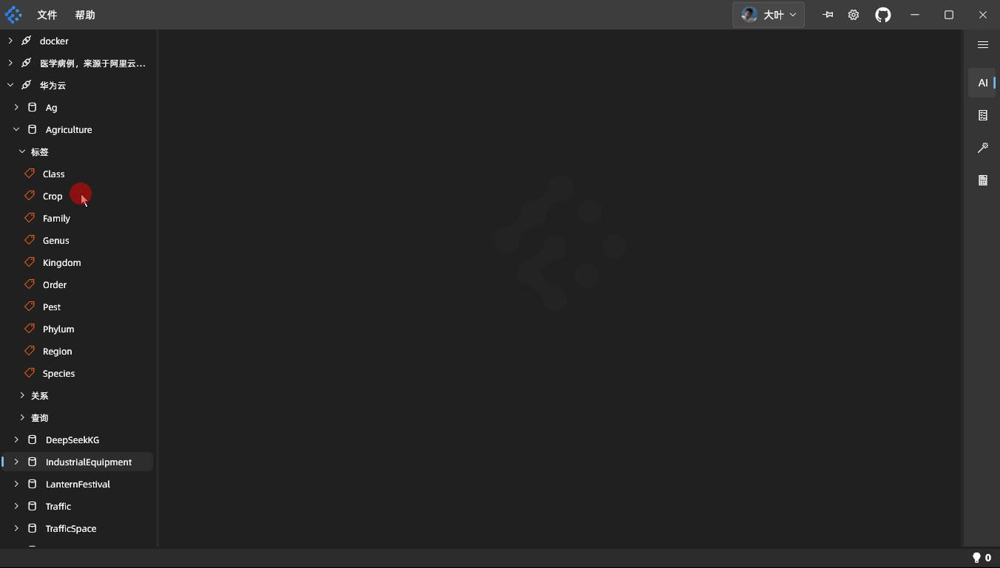

# 星影·图数据库客户端

> **星影**并不是一个开源项目，当前仓库仅用于发布星影的安装包、管理需求、用户反馈等。

<p align="center">
    </img>
</p>

<p align="center">图无界，数有联</p>

**星影**是一款图数据库客户端，它提供了图数据库的可视化操作界面，让用户可以通过图形化的方式，对图数据库进行操作。  
**星影**采用了全新的技术架构（[Flutter](https://github.com/flutter/flutter)），目前已经支持的操作系统有：Windows、macOS、Ubuntu | 优麒麟 三大常见操作系统。  
在图数据库层面，目前支持：[Nebula Graph](http://nebula-graph.com.cn/)。









- 官方网站：[https://dudu.ltd](https://dudu.ltd)
- 文档：[https://dudu.ltd/docs/zh/StarShadow/new-player.html](https://dudu.ltd/docs/zh/StarShadow/new-player.html)


## 星影是什么？
- 在图数据库生态中的定位，正在努力向关系型数据库生态中的 ` Navicat ` 看齐
- 是图数据库生态在桌面应用程序方向上的探索者

## 下载与安装

### 下载压缩包

- Windows: [star_shadow-2.2.0-windows-setup.exe](https://gitee.com/dudu-ltd/star-shadow-package/releases/download/v2.2.0/star_shadow-2.2.0-windows-setup.exe) | [signature](https://gitee.com/dudu-ltd/star-shadow-package/releases/download/v2.2.0/star_shadow-2.2.0-windows-setup.exe.signature)
- Windows: [StarShadow-win-v2.2.0.zip](https://gitee.com/dudu-ltd/star-shadow-package/releases/download/v2.2.0/StarShadow-win-v2.2.0.zip)
- macOS: [StarShadow-macos-v2.0.1.dmg](https://gitee.com/dudu-ltd/star-shadow-package/releases/download/v2.0.1/StarShadow-macos-v2.0.1.dmg)
- linux: [StarShadow_1.3.0_amd64.deb](https://gitee.com/dudu-ltd/star-shadow-package/releases/download/v1.3.0/StarShadow_1.3.0_amd64.deb)


## 安装

- Windows

    当前版本使用绿色版，直接解压至想要安装的目录即可。进入文件夹，然后找到【与众不同的图标.exe】双击打开即可。

- macOS  

    双击下载好的`StarShadow-macos-v2.0.1.dmg`进行安装即可。

- Ubuntu 24.04

    ```shell
    sudo dpkg -i StarShadow_1.3.0_amd64.deb
    sudo apt-get install libkeybinder-3.0
    sudo apt-get install libmpv2
    # /usr/local/lib/StarShadow 
    ```

-  优麒麟 24.04

    ```shell
    sudo dpkg -i StarShadow_1.3.0_amd64.deb
    sudo apt-get install libkeybinder-3.0
    # /usr/local/lib/StarShadow
    ```

使用微信扫码完成注册与登录，或选择【试用】免登录使用。

## 快速使用步骤
如果你还没有自己的图数据库，或者想了解我们推荐的用法，可以通过以下的步骤上手星影的用法。

1. 点击[示例项目](https://gitee.com/dudu-ltd/star-shadow-sample)的链接
2. 找到【克隆/下载】并点击
3. 在弹窗中找到【下载ZIP】并点击
4. 将下载的压缩包放置于你想用来放置星影数据的文件夹
5. 对压缩包解压到【当前文件夹】
6. 回到打开的星影图数据库客户端
    1. 在左上角找到【文件】
    2. 单击【打开文件夹】
    3. 选择在第5步中解压所的【star-shadow-sample-main】文件夹
    4. 单击弹窗右下角【选择文件夹】
7. 到此，你已经可以通过示例项目对星影进行体验

> 在上述第3步中，也可以使用 git clone 的方式，但为了避免你在后续的使用过程中，误提交了私有数据库的连接参数，请尽量使用下载ZIP的方式。  
如果你在未来的项目中，使用git对星影工作区进行管理，请谨慎提交到开源仓库。因为内部包含了数据库的连接信息。

## 示例项目的使用

1. 在打开的左侧导航树中，支持右键对相应的 schema 进行管理；
2. 在具体数据表格（tag、edge）中，序号列支持右键弹出界面完成对数据的操作；
3. 在【查询】的树节点下，你可以选中【MATCH】体验这次我们为你准备的脚本，其中包含了以下一些功能的使用：
    1. 我们在 nGQL 的基础上，拓展出了参数模板，你可以通过代码编辑区右侧的参数面板最右侧的序号 1、2、3... 完成多组参数的切换，选中哪组参数，点击【运行】，查询脚本即使用上哪组的参数完成数据查询：
    2. 可以在【MATCH】的示例用法中，体验到合并表头的表格、节点关系图的可视化、路径数据的可视化
    3. 可以在【GET SUBGRAPH】的示例用法中，体验到当结果中的每列又由表格组成，可以通过单击单元格打开一个由表格组成的弹窗，从而实现对表格数据的阅读。


### 在添加数据源时，使用我们提供的示例数据源

1. 在软件中找到【文件】->【添加数据源】
2. 填入以下信息：
    - 名称：医学病例，来源于阿里云天池
    - 数据库类型：NebulaGraph
    - 主机地址：gdbc.nebula://139.9.187.207:9669
    - 用户名：LetUs
    - 密码：WalkTogether
3. 点击【测试】，确认示例数据源的可用性
4. 点击【保存】，完成数据源的添加

> - 为了让用户体验更完整的功能，我们将DBA权限授予测试账户，请在使用过程中，尽量保持我们所提供的数据的相对完整性，以便其他用户也能够体验到更多的功能。
> - 另外，数据在用户间是共享的，请谨慎上传隐私数据。


## 最后
我们将在未来，通过示例项目持续补充图数据库的常用脚本。如果你在后续的过程中，也形成了好用的模板，并想与其他人进行分享，欢迎联系我们。

至此，对于一些基本的使用我们先介绍到这里。如果你对图形化的界面操作背后是怎么运行的，请前往下一站：[指南](https://dudu.ltd/docs/zh/StarShadow/help.html)

希望我们所做的工作能为你在图探索的过程中，扫掉一些障碍，希望我们可以一直结伴而行。


